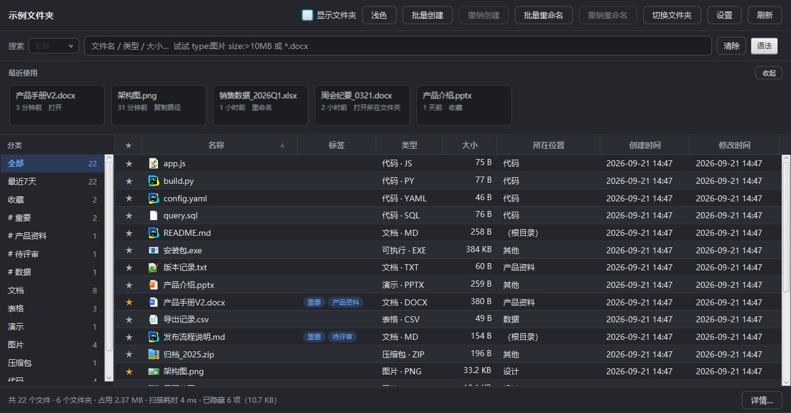

# 文件面板 FilePanel

> **放进任意文件夹就能列出全部文件**，可按文件名、类型、大小和正文搜索，支持重命名、批量创建、删除到回收站。

一个本地小工具：不联网、不上传任何东西、全部数据只存在你自己的文件夹里。
它最初是为"一个塞了很多文档和图纸的工作文件夹"写的，目标很具体——
**打开就能看懂、搜得到、改得动**，而不是又一个功能堆满的资源管理器。

---

## 它长什么样

| 界面总览 | 搜索（含正文） |
|---|---|
|  |  |

| 批量重命名 | 浅色 / 深色主题 |
|---|---|
|  |  |

更多截图（含缩略图、系统图标、设置、批量创建面板）见 [`docs/screenshots/`](docs/screenshots/)。

> 截图里的文件**全部是虚构的示例数据**（`demo\MakeDemo.java` 生成，`scripts\demo-screenshots.ps1` 一条命令重拍），
> 目录名、文件名、标签、正文都是编的。真实的文档名与路径不会出现在任何一张图里。

---

## 主要功能

- **放进去就能用**：程序所在目录 = 要管理的目录。不需要安装、不写注册表。
  也提供 **MSI 安装版**（仅当前用户、不弹 UAC），装完首次启动选一次文件夹并记住。
- **排除规则**：自动隐藏 `node_modules` / `.venv` / `target` / `__pycache__` 等
  34 条目录规则 + 17 条文件规则，把 1245 个文件压到 170 个左右，视图不被依赖包淹没。
  程序自己的 `app\`、`runtime\`、`.filepanel\` 也自动隐藏（按**精确路径**，不按名字）。
- **搜索**：文件名 / 扩展名 / 通配符 / 类型（中英文都认）/ 大小 / 修改时间 / 标签 / 收藏，
  多条条件空格分隔即"同时满足"。
  - **搜索范围下拉**：全部 / 文件名 / 类型 / 大小 —— 不学语法也能精确筛。
    **显式语法永远优先于范围**，粘进来的复杂查询不会被范围改义。
  - **可点击的语法面板**：9 条语法、15 个可点例子，点一下就填进搜索框。
- **全文内容搜索**：`content:关键词` 能搜 docx / xlsx / pptx / pdf / 文本**正文**，
  命中后多出一列显示"在哪命中的"。零新增依赖抽 Office 正文（它们本质是 ZIP+XML）。
- **批量创建**：一次建同一种文件夹或文件，支持前缀/关键词/后缀/数字或字母递增，
  **实时预览首尾项**，撞名可跳过或自动改名（绝不覆盖），数量按**预计耗时**三档保护，可整体撤销。
- **批量重命名**：查找替换、加前后缀、编号、模板；两阶段执行（`A↔B` 互换不丢文件）且**可撤销**。
- **删除按大小分流**：< 1 GB 进回收站、≥ 1 GB 直接永久删除，阈值可在设置里改。
  删除后会**另外查一次回收站条目数**再下结论——因为 Shell 会"报成功但其实永久删除了"。
- **缩略图与真实系统图标**：图片显示缩略图（异步解码 + LRU + 指纹失效），
  其他文件用 Windows 自己的类型图标；取不到时降级为自带色块，绝不空白。
- **最近使用 / 收藏 / 标签**、亮暗主题、列宽与窗口状态记忆。

---

## 快速开始

### 方式一：绿色版（推荐先试这个）

1. 解压 `FilePanel-便携版-*.zip`
2. 把 `FilePanel.exe`、`app\`、`runtime\` **一起**放进你要管理的文件夹
3. 双击 `FilePanel.exe`

**不需要装 Java**：程序自带裁剪过的运行时（约 58 MB，这就是它体积的来源）。

### 方式二：安装版（MSI）

双击 `FilePanel-安装版-*.msi`。仅当前用户安装，不需要管理员权限。
装完首次启动会让你选一次要管理的文件夹，之后记住。

升级 = 用更高的版本号重新打包，再运行新的 MSI，Windows 会自动卸旧装新。

---

## 从源码构建

**要求**：JDK 17+（本机脚本硬编码 `C:\jdk17`，见注意事项）、Windows。

```cmd
cd FilePanel
scripts\build.cmd              :: 编译 + 跑测试 + 打 jar
scripts\run.cmd                :: 用开发方式启动（管的是上一级目录）
scripts\package.cmd            :: 生成自带 JRE 的绿色版（target\dist\FilePanel）
scripts\package.cmd deploy     :: 平铺部署到上一级目录，产出可直接双击的 exe
scripts\package.cmd installer  :: 打 MSI 安装包（需要先跑 scripts\fetch-wix.mjs）
```

首次构建若缺 Maven，先执行 `node scripts\fetch-maven.mjs`（下载到 `tools\`，不入版本库）。

**两个必须知道的注意事项**（都踩过坑）：

1. **不要绕过 `scripts\*.cmd`**：本机环境变量里的 `JAVA_HOME` 指向 JDK 8，
   而脚本内部强制 `JAVA_HOME=C:\jdk17`。直接调 `mvn` 会得到一堆
   `UnsupportedClassVersionError` 或 JavaFX 模块找不到。
2. **`.cmd` 文件必须保持纯 ASCII + CRLF**：脚本里有 `chcp 65001`，
   而 cmd.exe 按**字节偏移**跟踪自己在批处理里的位置——掺进非 ASCII 字节会让解析器
   从一行中间继续执行；`goto :label` 在裸 LF 换行下会报 `cannot find the batch label`。

---

## 文档

| 文档 | 面向谁 | 内容 |
|---|---|---|
| [`docs/便携版使用说明.txt`](docs/便携版使用说明.txt) | **普通用户** | 零术语，只讲怎么用 |
| [`docs/使用说明-技术人员版.md`](docs/使用说明-技术人员版.md) | 构建 / 部署 / 排障 | 脚本说明、`JAVA_HOME` 与 CRLF 陷阱、依赖取舍、命令行模式表、故障速查、**验证纪律** |
| [`docs/架构与代码说明.md`](docs/架构与代码说明.md) | **想改代码的人** | 分层依赖、65 个类逐一说明、5 条数据流、9 份 JSON 格式、**10 个扩展场景**、坑索引 |
| [`docs/文件面板-开发计划.md`](docs/文件面板-开发计划.md) | 想了解怎么一步步做出来的 | 里程碑 M0~M11、设计决策、验收标准与逐条对账、未完成清单 |
| [`docs/实施笔记.md`](docs/实施笔记.md) | 所有人 | **68 条真实踩过的坑**，每条都写症状 / 根因 / 规避 / 教训 |

> 这套文档是按"**以后接手的人不用问原作者**"写的：
> 时间长了对话记录不会在，但源码、设计理由和踩过的坑都在文档里。

---

## 项目结构

```
FilePanel\
├─ pom.xml                        Java 17 + JavaFX 17.0.13（必须显式带 win classifier）
├─ LICENSE                        MIT
├─ assets\                        图标源（app.ico 给 jpackage，app.png 生成多尺寸窗口图标）
├─ src\main\java\com\zean\filepanel\
│  ├─ core\                       纯逻辑：扫描、搜索解析、排除规则、删除策略、LRU
│  ├─ ops\                        文件系统操作：打开/重命名/删除/内容抽取/批量创建
│  ├─ store\                      JSON 持久化：配置、最近、收藏、标签、索引、各类撤销日志
│  ├─ ui\                         JavaFX：主窗口、表格、搜索栏、侧栏、对话框
│  └─ win\                        JNA：回收站、系统图标（不依赖 JavaFX，便于单独排查）
├─ src\test\                      295 个测试（纯逻辑 + 临时目录上的真实文件操作）
├─ demo\MakeDemo.java             生成截图用的虚构示例文件夹（不进版本库的是生成结果）
├─ scripts\                       构建/运行/打包/验证脚本（.cmd 全部纯 ASCII + CRLF）
└─ docs\                          全部文档与截图证据
```

**不引入的依赖也是决策**：Office 正文用 JDK 自带 `java.util.zip` 解 ZIP+XML，
**不用 POI**；没有日志框架，用 `System.err`；没有 ORM，用 Jackson 直接读写 JSON。

---

## 命令行模式（都为"可验证"而存在）

```
FilePanel --scan [目录]              无界面扫描并输出统计
FilePanel --selftest                 环境自检（JDK、JavaFX、自带运行时、样式表）
FilePanel --ui-selftest [目录]       界面整链路自检（最全的一键验证）
FilePanel --screenshot <png>         把界面渲染成 PNG
FilePanel --content-search <关键词>  无界面建立内容索引并输出命中
FilePanel --delete-test <文件>       按当前策略真删一个文件并报告走了哪条分支
FilePanel --recycle-test <文件>      验证删除是否真的进了回收站
FilePanel --icon-sheet <png>         把系统真实图标打成图集
FilePanel --settings-preview <png>   只渲染设置面板
FilePanel --create-preview <png>     只渲染批量创建面板
FilePanel --delete-preview <png>     只渲染删除确认框
FilePanel --help                     帮助
```

**为什么值得单独做这些**：有一类缺陷只能"看"出来（CSS 写错、下拉框漏转中文、图标方向颠倒），
另一类只能"在真实环境跑"才暴露（回收站其实没进回收站）。所以这个项目坚持
**把界面画出来看、把结果做成可断言的文本、不轻信任何 API 的成功返回值**。

---

## 已知限制

- **删除在 JavaFX 线程上同步执行**：走回收站的文件要真的把数据搬进 `C:\$Recycle.Bin`，
  一个 900 MB（阈值以下）的文件可能让界面卡几秒。永久删除那一侧没有这个问题。
- **首次运行会在 `%USERPROFILE%\.openjfx\cache` 建约 3.4 MB 的 JavaFX 原生库缓存**
  （打包时没设 `javafx.cachedir`）。
- **没有代码签名证书**：安装包与 exe 会触发 SmartScreen"已保护你的电脑"提示，
  需要点"更多信息 → 仍要运行"。这是签名证书的问题，不是程序行为。
- M8/M9/M10/M11 的完整未完成清单见开发计划文档的 §8.2。

---

## 许可证

[MIT](LICENSE) © 2026 Lineer

可以自由使用、修改、商用、再发布，只要保留版权声明与许可证文本。
本软件按"现状"提供，不附带任何形式的担保。
